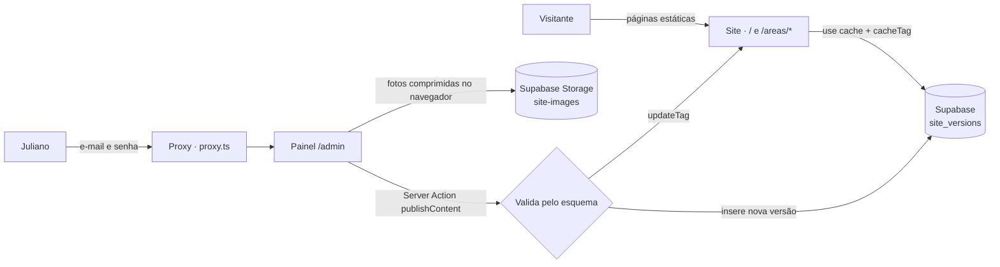

<div align="center">

# Juliano Martins · Advocacia

**Site institucional com painel de edição próprio para um advogado em Piracaia/SP.**<br>
Direito previdenciário, trabalhista, cível e consumidor, família e sucessões e criminal.

[](https://nextjs.org)
[](https://react.dev)
[](https://www.typescriptlang.org)
[](https://tailwindcss.com)
[](https://supabase.com)

[**advjulianomartins.com.br**](https://advjulianomartins.com.br)

<br>


</div>

<br>

## Sobre o projeto

Site do advogado **Juliano Martins**, com escritório no Centro de Piracaia (SP). O layout de referência está em [`docs/juliano-martins-advocacia-atualizado.html`](docs/juliano-martins-advocacia-atualizado.html).

O Juliano troca textos e fotos sozinho pelo **painel `/admin`**, feito sob medida: mostra só o que existe no site, com nomes simples ("Topo da página", "Áreas de atuação", "Dúvidas frequentes") e funciona bem no celular. O que é estrutural (layout, cores, novas seções) continua no código.

Os textos padrão seguem o **Provimento 205/2021 da OAB** (publicidade na advocacia): são informativos, sem promessa de resultado, sem preços e sem chamadas de captação.

## Funcionalidades

### Site
- **Página inicial fiel ao layout**, do celular ao desktop, com **tema claro e escuro** (segue o sistema e lembra a escolha, sem "piscar").
- **Uma página por área de atuação** (`/areas/direito-previdenciario`, `/areas/direito-trabalhista`…), com texto próprio, lista "Como posso ajudar" e contato, pensada para buscas locais como *"advogado previdenciário em Piracaia"*.
- **WhatsApp em todo lugar**: botão flutuante, botões principais e cartões das áreas, que já mandam o nome da área na mensagem.
- **Endereço com rota** no Google Maps.
- **Dúvidas frequentes** com acordeão acessível (`<details>`), sem JavaScript.
- **Foto otimizada** com `next/image` (AVIF/WebP, tamanhos responsivos).
- **Páginas estáticas** (Cache Components): carregam rápido e são regeradas na hora quando algo é publicado.

### Painel `/admin`
- **Login com e-mail e senha**; só os e-mails da tabela `admins` podem publicar.
- **Formulário gerado a partir de um esquema**, com ajudas e **contador de caracteres** para o layout nunca quebrar.
- **Troca de foto pela galeria do celular**, com compressão no navegador (até 2000px, WebP) antes do envio.
- **Listas editáveis** (destaques, parágrafos, perguntas) e textos das páginas de cada área.
- **Prévia**, **rascunho automático**, **histórico de versões** com "voltar para esta versão" e **publicação instantânea** (`updateTag`).

### SEO
- Título e descrições focados em *"advogado em Piracaia"*, *"advogado previdenciário / INSS"* e nas demais áreas.
- **Dados estruturados** (JSON-LD): `LegalService` com endereço, `Person` (com o registro na OAB), `WebSite`, `FAQPage`, `Service` e `BreadcrumbList` nas páginas das áreas.
- **Card de compartilhamento** gerado com `next/og` e **ícone "JM"** gerado em código.
- `sitemap.xml` com todas as páginas, `robots.txt` (com o `/admin` bloqueado), canonical em cada página e `noindex` no painel.
- **`/llms.txt`**: resumo do escritório para assistentes de IA (ChatGPT, Perplexity, Gemini).
- Cabeçalhos de segurança (HSTS, `nosniff`, `Referrer-Policy`…).

## Tecnologias

| Camada | Tecnologia | Para quê |
| --- | --- | --- |
| Framework | [Next.js 16.4](https://nextjs.org) (App Router, Turbopack, Cache Components) | Páginas estáticas com `use cache`, Server Actions, Proxy e imagens geradas |
| Interface | [React 19](https://react.dev) | `useActionState`, `useTransition`, Server e Client Components |
| Linguagem | [TypeScript 5](https://www.typescriptlang.org) | Tipagem de ponta a ponta do conteúdo editável |
| Estilo | [Tailwind CSS 4](https://tailwindcss.com) | Paleta do layout em tokens CSS, tema escuro e mobile-first |
| Fontes | `next/font` · Source Serif 4 + Inter | Fontes self-hosted, sem layout shift |
| Banco de dados | [Supabase Postgres](https://supabase.com/database) | Versões do conteúdo em `jsonb`, com Row Level Security |
| Autenticação | [Supabase Auth](https://supabase.com/auth) + `@supabase/ssr` | Sessão em cookies, renovada pelo `proxy.ts` |
| Arquivos | [Supabase Storage](https://supabase.com/storage) | Fotos enviadas pelo painel |

## Arquitetura



- **Conteúdo versionado**: cada "Publicar" grava uma linha nova em `site_versions`; o site mostra a mais recente.
- **Um esquema, três usos**: [`lib/content/schema.ts`](lib/content/schema.ts) gera o formulário do painel, valida no servidor e define os limites de caracteres.
- **À prova de mudanças**: [`normalizeContent`](lib/content/validate.ts) encaixa versões antigas do banco no formato atual.
- **Endereços fixos**: as URLs das áreas ficam em [`lib/content/areas.ts`](lib/content/areas.ts), então editar um título nunca quebra links nem o Google.
- **Segurança em camadas**: proxy, verificação nas Server Actions e RLS no banco (`is_admin()`), inclusive no upload.
- **Funciona sem banco**: sem as variáveis do Supabase, o site continua no ar com o conteúdo padrão.

## Estrutura

```
app/
├── page.tsx                 # Página inicial
├── areas/[slug]/page.tsx    # Página de cada área de atuação
├── layout.tsx               # Fontes, metadata, tema
├── opengraph-image.tsx · icon.tsx · apple-icon.tsx
├── sitemap.ts · robots.ts · llms.txt/route.ts · not-found.tsx
└── admin/                   # Painel: editor, login, histórico, senha
components/
├── site/                    # Seções, header, tema, páginas das áreas
└── admin/                   # Editor, campos, prévia, formulários
lib/
├── content/                 # Tipos, conteúdo padrão, áreas, esquema, validação e leitura
├── supabase/                # Clientes de servidor e de navegador
├── structured-data.ts       # JSON-LD (schema.org)
└── seo.ts · contact.ts · brand-assets.tsx
supabase/migrations/         # Tabelas, RLS e bucket de fotos
proxy.ts                     # Sessão e proteção do /admin
```

## Rodando localmente

**Requisitos:** Node.js 20.9+ e um projeto no [Supabase](https://supabase.com) (o plano gratuito atende).

```bash
npm install
cp .env.example .env.local   # preencha com os dados do Supabase
npm run dev
```

Acesse [localhost:3000](http://localhost:3000) para ver o site e [localhost:3000/admin](http://localhost:3000/admin) para o painel.

### Variáveis de ambiente

| Variável | Obrigatória | Descrição |
| --- | --- | --- |
| `NEXT_PUBLIC_SUPABASE_URL` | Sim | Project URL (Project Settings → Data API) |
| `NEXT_PUBLIC_SUPABASE_PUBLISHABLE_KEY` | Sim | Publishable key (Project Settings → API Keys) |
| `NEXT_PUBLIC_SITE_URL` | Não | Domínio oficial. Padrão: `https://advjulianomartins.com.br` |
| `NEXT_PUBLIC_GOOGLE_SITE_VERIFICATION` | Não | Código de verificação do Google Search Console |

### Configurando o Supabase

1. No **SQL Editor**, rode [`supabase/migrations/0001_site_content.sql`](supabase/migrations/0001_site_content.sql).
2. Libere quem pode editar:
   ```sql
   insert into public.admins (email) values ('email@exemplo.com');
   ```
3. Em **Authentication → Sign In / Providers**, desative *Allow new users to sign up*.
4. Em **Authentication → Users → Add user**, crie o login com o mesmo e-mail (marcando *Auto Confirm User*).

## Scripts

| Comando | Descrição |
| --- | --- |
| `npm run dev` | Servidor de desenvolvimento |
| `npm run build` | Build de produção |
| `npm start` | Servidor de produção |
| `npm run lint` | ESLint |
| `npm run typecheck` | Checagem de tipos do TypeScript |

## Commits e versões

O projeto segue [**Conventional Commits**](https://www.conventionalcommits.org/pt-br) (`feat:`, `fix:`, `docs:`…). **Husky + commitlint** recusam mensagens fora do padrão, **lint-staged** roda o ESLint nos arquivos alterados, o **CI** roda lint, tipos e build, e o **release-please** gera a versão e o `CHANGELOG.md`.

## Licença

O **código** está sob a [licença MIT](LICENSE). A **foto, os textos e a identidade** de Juliano Martins não fazem parte dessa licença e não podem ser reutilizados sem autorização dele.

<br>

<div align="center">

Desenvolvido por [**Felipe Nogueira**](https://nogueiradev.com.br)

</div>
